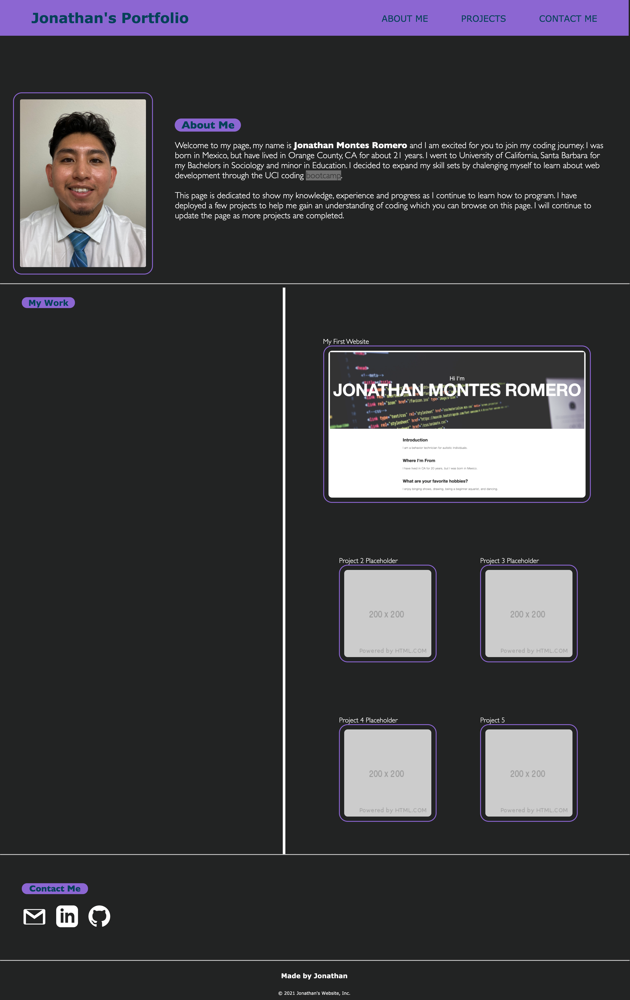

--------------------------------------

# Join-My-Journey

The task was to produce a website from scratch that contains all my progress and projects as a web developer. 

  
--------------------------------------

## The Process 

Building this website from scratch presented some challenges because I would notice that some code would break
and I would have to go back and try to fix the issue. I looked through past activities to get an idea of things
that could work and how to resolve certain issues. Although a lot of the activities did provide a starting point
I still found myself having to google solutions or find codes to fit how I wanted my page set up. 

I also watched some Youtube tutorials for page set ups that would provide a better look to the website I was 
creating. Below I have included the links to the two youtuber pages that provided further assistance in completing 
the site to fit my current understanding of HTML and CSS.

Two youtubers I used for help:

* [Ania Kubow](https://www.youtube.com/watch?v=-D6oTPA4vXc&t=3329s)

* [Kevin Powell](https://www.youtube.com/watch?v=FEmysQARWFU)

Resources used:

* [Scroll Button](https://mdbootstrap.com/docs/standard/extended/back-to-top/)

* [Bootstrap](https://getbootstrap.com/)

### Navigate my page

Here is a link to my deployed page that I will continue to update and fix.

[Join my Journey Weboage](https://jmonrom.github.io/Join-My-Journey/)

